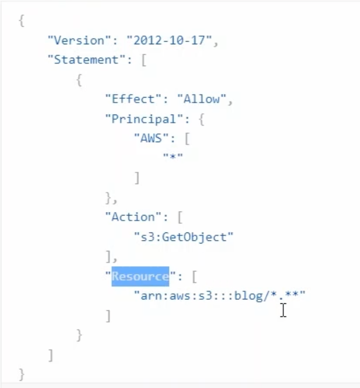

基础架构

支持
Springboot3
MYSQL
ES
redis
security6
swagger3
mongodb
rabbitmq
MinIO

使用前需要开启ES、Kinaba、redis、mongodb、MinIO

Swagger:http://localhost:8090/swagger-ui/index.html#/

Kinaba:http://localhost:5601

ES：http://localhost:9200

redis:客户端

monogo：客户端

rabbitmq：http://localhost:15672/

MinIO登陆地址：http://localhost:9090
  RootUser: minioadmin
  RootPass: minioadmin
也可以使用AWS S3客户端登陆 https://s3browser.com/ ps：只有windows版本
 访问策略：
 

    
